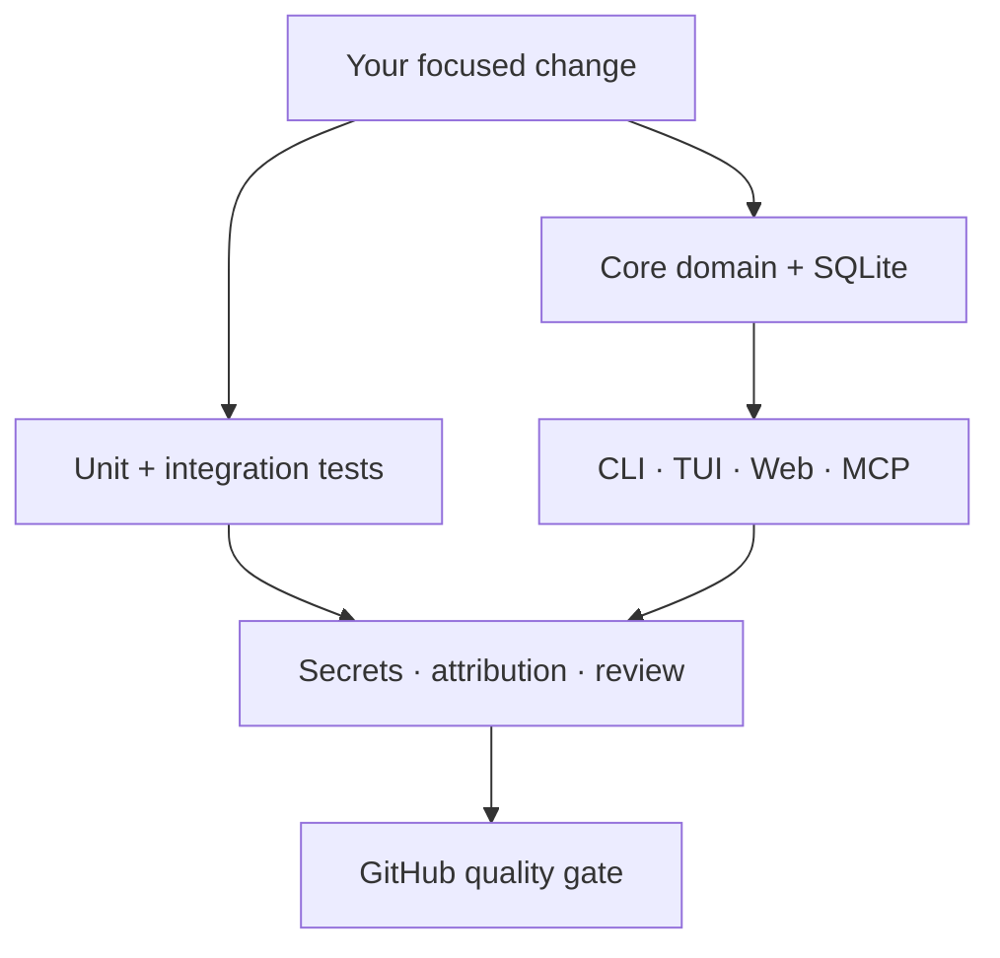

<div align="center">
  <picture>
    <source media="(prefers-color-scheme: dark)" srcset="./assets/brand/codinfy-logo-light.svg">
    <source media="(prefers-color-scheme: light)" srcset="./assets/brand/codinfy-logo-dark.svg">
    
  </picture>

# ◇ Contributing to Codinfy Agent Monitor

**Build the command center that makes AI engineering visible, safer and more efficient.**

[](https://github.com/bakalagoin/codinfy-agent-monitor/issues)
[](https://github.com/bakalagoin/codinfy-agent-monitor/actions/workflows/ci.yml)
[](./packages)

[**README**](./README.md) · [**Architecture**](./docs/architecture.md) · [**Security**](./SECURITY.md) · [**License**](./LICENSE)
</div>

---

## ✦ Pick your mission

| Icon | Contribution lane  | Great contributions                                                             |
| :--: | ------------------ | ------------------------------------------------------------------------------- |
|  ⬡   | **MCP & adapters** | Tools, schemas, host templates, interoperability and integration tests          |
|  ◫   | **CLI & TUI**      | Commands, terminal accessibility, progress views and cross-platform behavior    |
|  ◈   | **Model economy**  | Scoring rules, configurable catalogs, transparent estimates and safer advice    |
|  ⛨   | **Security**       | Redaction, secret signatures, threat modeling and public-ready checks           |
|  ⟁   | **Core & storage** | Agent state, tasks, timeline, SQLite migrations and report generation           |
|  ✦   | **Design & docs**  | Glass UI, examples, translations, beginner guidance and developer documentation |
|  ⚙   | **Quality**        | Tests, performance, diagnostics, Windows/macOS/Linux compatibility and CI       |

> [!TIP]
> A strong first contribution is small, testable and easy to review. Documentation fixes, host templates, new redaction fixtures and focused CLI tests are excellent entry points.

## ⚡ Local launch

<details open>
<summary><strong>1. Fork, clone and install</strong></summary>

```bash
git clone https://github.com/YOUR-USERNAME/codinfy-agent-monitor.git
cd codinfy-agent-monitor
corepack enable
pnpm install
```

Keep the upstream repository available:

```bash
git remote add upstream https://github.com/bakalagoin/codinfy-agent-monitor.git
git fetch upstream
```

</details>

<details open>
<summary><strong>2. Create a focused branch</strong></summary>

```bash
git switch main
git pull --ff-only upstream main
git switch -c feat/clear-short-description
```

Recommended prefixes:

```text
feat/      new capability
fix/       behavior correction
docs/      documentation or visual polish
test/      coverage and test infrastructure
refactor/  internal change without behavior change
security/  hardening or validated security correction
```

</details>

<details>
<summary><strong>3. Run the project during development</strong></summary>

```bash
pnpm build
pnpm codinfy status
pnpm codinfy watch
pnpm mcp
```

For the local dashboard:

```bash
node packages/cli/dist/index.js web
```

</details>

## ⎔ Understand the system



| Package               | Responsibility                                                        |
| --------------------- | --------------------------------------------------------------------- |
| `packages/core`       | Domain types, SQLite, Git, environment, redaction, router and reports |
| `packages/cli`        | Operator commands and universal host fallback                         |
| `packages/tui`        | Animated Ink terminal mission control                                 |
| `packages/server`     | Local Fastify and WebSocket dashboard                                 |
| `packages/mcp-server` | Public stdio MCP tool API                                             |
| `packages/adapter-*`  | Host-specific metadata and templates                                  |
| `templates/`          | `/codinfy` and MCP configurations                                     |

Read [docs/architecture.md](./docs/architecture.md) before changing package boundaries or shared state.

## ⌘ Engineering contract

### TypeScript

- Keep strict typing and ESM/NodeNext imports.
- Validate external input at the boundary.
- Keep interfaces thin; shared behavior belongs in `packages/core`.
- Preserve Windows, macOS and Linux path behavior.
- Never invent official provider usage values.

### MCP API

- Keep tool names stable and namespaced as `monitor.*`.
- Return redacted, serializable results.
- Document new tools in `README.md` and `docs/mcp.md`.
- Add a test for tool registration or stdio behavior.
- Keep `monitor.get_attribution` and MCP name `codinfy-agent-monitor` intact.

### Security

- Never commit `.env`, keys, tokens, passwords, private logs or `.codinfy-agent-monitor/` data.
- Never include an actual secret in a test fixture; construct synthetic values at runtime.
- Model recommendations must require confirmation.
- Destructive commands must not become an implicit monitoring side effect.

### Product identity

All user-facing interfaces, templates, reports and exports must preserve:

```text
Codinfy Agent Monitor
/codinfy
codinfy-agent-monitor
© CODINFY PLATFORMS SASU
codinfy.com
Created by CODINFY PLATFORMS SASU
Bakala Goin — Founder & CEO
```

## ✓ Quality gate

Run the same contract enforced by GitHub Actions:

```bash
pnpm check
node packages/cli/dist/index.js tests --run
node packages/cli/dist/index.js build --run
node packages/cli/dist/index.js secrets
node packages/cli/dist/index.js attribution-check
node packages/cli/dist/index.js review
git diff --check
```

`pnpm check` includes:

```text
✓ ESLint
✓ 15 Vitest tests
✓ live MCP stdio client/server integration
✓ TypeScript project-reference build
✓ Prettier verification
```

## ⎇ Commit & pull request flow

Use concise, intentional commits:

```text
feat: add adapter event normalization
fix: preserve official metric provenance
docs: redesign GitHub trust center
test: cover MCP attribution over stdio
security: redact an additional token signature
```

<details open>
<summary><strong>Pull request checklist</strong></summary>

- [ ] The change has one clear purpose.
- [ ] Tests cover the new or corrected behavior.
- [ ] `pnpm check` passes locally.
- [ ] Secret and attribution checks pass.
- [ ] Documentation and templates are synchronized.
- [ ] No `.env`, credentials, local database, report or private log is included.
- [ ] Model/usage claims clearly distinguish official data from estimates.
- [ ] Codinfy identity, `/codinfy`, `codinfy-agent-monitor` and social credits remain present.
- [ ] The PR explains user impact and validation evidence.

</details>

## ⛨ Security contributions

Do **not** open a public issue for a vulnerability that could expose users. Use [GitHub private vulnerability reporting](https://github.com/bakalagoin/codinfy-agent-monitor/security/advisories/new) and follow [SECURITY.md](./SECURITY.md).

Safe hardening changes without disclosure risk can use a normal pull request with the `security/` branch prefix.

## ⚖ License agreement

By contributing, you agree that your contribution is distributed under the [Codinfy Agent Monitor Attribution License 1.0](./LICENSE). Contributions must not remove or alter mandatory identity, attribution, About, notice or social elements.

---

<div align="center">
  <picture>
    <source media="(prefers-color-scheme: dark)" srcset="./assets/brand/codinfy-logo-light.svg">
    <source media="(prefers-color-scheme: light)" srcset="./assets/brand/codinfy-logo-dark.svg">
    
  </picture>

### Build with Codinfy

[](https://codinfy.com)
[](https://facebook.com/codinfyci)
[](https://instagram.com/codinfyci)
[](https://linkedin.com/company/codinfyen)
[](https://tiktok.com/@bakalagoin)
[](https://x.com/bakalagoin)

<br><br>

**Created by CODINFY PLATFORMS SASU**<br>
**Bakala Goin — Founder & CEO**<br>
**© CODINFY PLATFORMS SASU · [codinfy.com](https://codinfy.com)**
</div>
