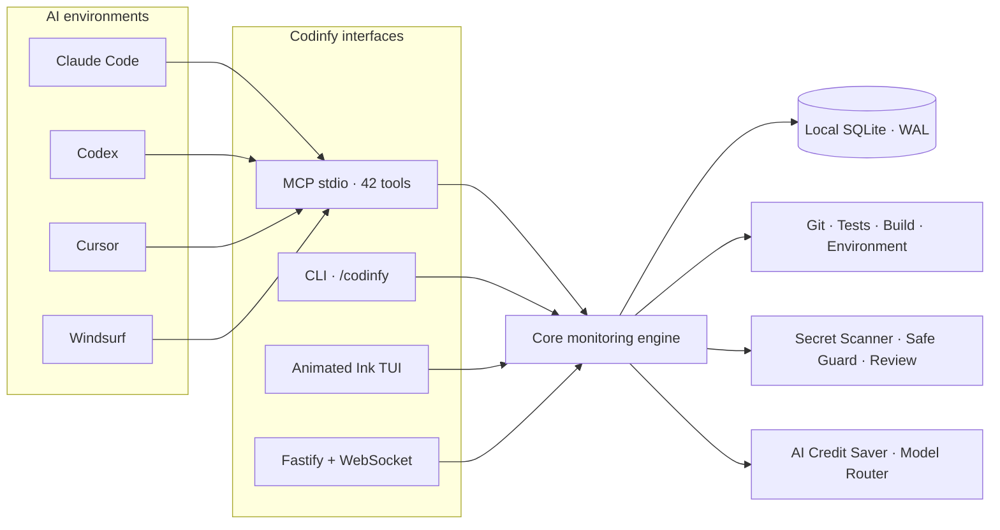

<div align="center">
  <picture>
    <source media="(prefers-color-scheme: dark)" srcset="./assets/brand/codinfy-logo-light.svg">
    <source media="(prefers-color-scheme: light)" srcset="./assets/brand/codinfy-logo-dark.svg">
    
  </picture>

<br><br>

# Codinfy Agent Monitor

**Real-time mission control for AI engineering teams.**

Observe agents, context, limits, workflows, Git, security and model economy from one local-first command center.

  <br>

[](https://github.com/bakalagoin/codinfy-agent-monitor/actions/workflows/ci.yml)
[](./CHANGELOG.md)
[](#-mcp-tool-api)
[](#-requirements)
[](./LICENSE)

[](https://github.com/bakalagoin/codinfy-agent-monitor/stargazers)
[](https://github.com/bakalagoin/codinfy-agent-monitor/forks)
[](https://github.com/bakalagoin/codinfy-agent-monitor/commits/main)
[](./packages)

  <br>

[**Overview**](#-the-mission) · [**Quick start**](#-launch-in-60-seconds) · [**Command center**](#-command-center) · [**MCP API**](#-mcp-tool-api) · [**Architecture**](#-architecture) · [**Security**](./SECURITY.md) · [**Contributing**](./CONTRIBUTING.md) · [**License**](./LICENSE)
</div>

<br>

<p align="center">
  
</p>

---

## ✦ The mission

AI agents move fast. Their context, tool calls, file changes, limits and failures usually remain scattered across terminals and provider interfaces. **Codinfy Agent Monitor** turns that invisible activity into a single operational picture.

|     | Mission system       | What it reveals                                                                  |
| :-: | -------------------- | -------------------------------------------------------------------------------- |
| 🛰️  | **Agent Radar**      | Active, idle, thinking, running, blocked, failed and completed agents            |
|  ◫  | **Context & Limits** | Context, current rate, daily and weekly usage with official/estimated provenance |
|  ⟁  | **Workflow Pulse**   | Tasks, owners, progress, blockers, files and a real-time event timeline          |
|  ◈  | **AI Credit Saver**  | Model Need Score, safer model category and estimated token/cost savings          |
|  ⛨  | **Safe Guard**       | Secret scanning, sensitive-file detection and review before commit               |
|  ⎇  | **Dev Operations**   | Git state, tests, builds, environment and public-ready checks                    |
|  ◉  | **Codix Observer**   | Context-aware recommendations for risk, economy and next actions                 |
|  ⇄  | **Universal MCP**    | Claude Code, Codex, Cursor, Windsurf and other MCP-compatible hosts              |

> [!IMPORTANT]
> Exact provider limits are displayed as `official` only when a host or adapter supplies them directly. Otherwise the interface clearly enables **estimate mode**. Codinfy Agent Monitor never presents a local estimate as provider truth.

## ⚡ Launch in 60 seconds

<details open>
<summary><strong>01 — Install from source</strong></summary>

```bash
git clone https://github.com/bakalagoin/codinfy-agent-monitor.git
cd codinfy-agent-monitor
corepack enable
pnpm install
pnpm build
pnpm --filter codinfy-agent-monitor link --global
```

</details>

<details open>
<summary><strong>02 — Initialize the local command center</strong></summary>

```bash
codinfy-agent-monitor init
codinfy-agent-monitor status
```

Your private operational data is created inside `.codinfy-agent-monitor/` and excluded from Git.

</details>

<details>
<summary><strong>03 — Open the animated TUI or local glass dashboard</strong></summary>

```bash
# Animated terminal mission control
codinfy-agent-monitor watch

# Local Fastify + WebSocket dashboard
codinfy-agent-monitor web
```

Open [`http://localhost:3579/codinfy`](http://localhost:3579/codinfy). `/dashboard` and `/codinfy-agent-monitor` remain supported aliases. The server binds to `127.0.0.1` and rejects foreign Host/Origin values.

</details>

Without a global link:

```bash
pnpm codinfy status
pnpm codinfy watch
pnpm mcp
```

## ◫ Command center

```text
╭────────────────── Codinfy Agent Monitor ──────────────────╮
│ Project: codinfy-agent-monitor                             │
│ Active AI: Codex · Command: /codinfy                       │
│ MCP: codinfy-agent-monitor                                 │
├────────────────────────────────────────────────────────────┤
│ Context used           ██████████████░░░░░░ 68% official   │
│ Current rate           ████████░░░░░░░░░░░░ 42% estimated  │
│ Daily limit            ████████████████░░░░ 81% estimated  │
│ Weekly limit           ████████░░░░░░░░░░░░ 42% estimated  │
├────────────── AI Credit Saver & Smart Router ──────────────┤
│ Current model: Premium Reasoning                           │
│ Recommended: Standard Code · estimated saving: 45%         │
│ Model switch: confirmation required                        │
├────────────────────────────────────────────────────────────┤
│ Agents: 5 active · 3 idle · Workflow: 7 tasks              │
│ ✓ secrets.clean  ✓ tests.passed  ✓ build.passed            │
╰────────────────────────────────────────────────────────────╯
  © CODINFY PLATFORMS SASU · codinfy.com
```

<div align="center">

| Interface         | Command                        | Experience                              |
| ----------------- | ------------------------------ | --------------------------------------- |
| **Snapshot**      | `codinfy-agent-monitor status` | Fast operational overview               |
| **Animated TUI**  | `codinfy-agent-monitor watch`  | Live terminal bars and agent activity   |
| **Web glass UI**  | `codinfy-agent-monitor web`    | Responsive local dashboard + WebSocket  |
| **MCP server**    | `codinfy-agent-monitor mcp`    | Tool API for compatible AI environments |
| **Slash command** | `/codinfy`                     | Native host-oriented monitoring flow    |

</div>

## ⌘ Operator commands

<details open>
<summary><strong>Monitoring & workflow</strong></summary>

```bash
codinfy-agent-monitor status
codinfy-agent-monitor agents
codinfy-agent-monitor context
codinfy-agent-monitor limits
codinfy-agent-monitor workflow
codinfy-agent-monitor tasks
codinfy-agent-monitor timeline
codinfy-agent-monitor files
codinfy-agent-monitor health
```

</details>

<details>
<summary><strong>Engineering, Git & release safety</strong></summary>

```bash
codinfy-agent-monitor git
codinfy-agent-monitor diff
codinfy-agent-monitor tests --run
codinfy-agent-monitor build --run
codinfy-agent-monitor secrets
codinfy-agent-monitor check-command "git push --force"
codinfy-agent-monitor attribution-check
codinfy-agent-monitor review
codinfy-agent-monitor public-ready
codinfy-agent-monitor commit-message
codinfy-agent-monitor pr
codinfy-agent-monitor docs-check
codinfy-agent-monitor handoff
```

</details>

<details>
<summary><strong>AI Credit Saver & Smart Model Router</strong></summary>

```bash
codinfy-agent-monitor saver
codinfy-agent-monitor budget
codinfy-agent-monitor cost
codinfy-agent-monitor model-score "audit the authentication architecture"
codinfy-agent-monitor model-advice "update the README"
codinfy-agent-monitor model-rules
codinfy-agent-monitor switch-model standard_code
codinfy-agent-monitor economy-plan
```

The router recommends configurable categories — `fast_cheap`, `standard_code`, `advanced_code` or `premium_reasoning` — instead of hard-coding provider model names. **It never changes the active model without confirmation.**

</details>

<details>
<summary><strong>Beginner & guided mode</strong></summary>

```bash
codinfy-agent-monitor beginner
codinfy-agent-monitor next
codinfy-agent-monitor checklist
codinfy-agent-monitor glossary
codinfy-agent-monitor explain-error
codinfy-agent-monitor simple-report
codinfy-agent-monitor install-guide
codinfy-agent-monitor github-guide
codinfy-agent-monitor learn
```

</details>

<details>
<summary><strong>Language, user level & environment</strong></summary>

```bash
codinfy-agent-monitor language auto
codinfy-agent-monitor language fr
codinfy-agent-monitor level beginner
codinfy-agent-monitor level expert
codinfy-agent-monitor safe on
codinfy-agent-monitor environment
codinfy-agent-monitor doctor
```

</details>

## ⬡ MCP Tool API

Start the local stdio server:

```bash
codinfy-agent-monitor mcp
```

```json
{
  "mcpServers": {
    "codinfy-agent-monitor": {
      "command": "codinfy-agent-monitor",
      "args": ["mcp"]
    }
  }
}
```

| Tool domain       | MCP tools                                                                                                                                                                   |
| ----------------- | --------------------------------------------------------------------------------------------------------------------------------------------------------------------------- |
| **Status**        | `monitor.status`, `monitor.open_dashboard`, `monitor.get_attribution`                                                                                                       |
| **Agents**        | `monitor.list_agents`, `monitor.register_agent`, `monitor.update_agent_state`                                                                                               |
| **Usage**         | `monitor.get_context_usage`, `monitor.get_rate_limit_status`, `monitor.get_daily_usage`, `monitor.get_weekly_usage`                                                         |
| **Model economy** | `monitor.get_model_advice`, `monitor.get_model_score`, `monitor.get_budget_status`, `monitor.get_economy_plan`                                                              |
| **Workflow**      | `monitor.create_task`, `monitor.update_task`, `monitor.list_tasks`, `monitor.get_workflow`, `monitor.timeline`                                                              |
| **Engineering**   | `monitor.git_status`, `monitor.git_diff`, `monitor.test_status`, `monitor.build_status`, `monitor.environment_status`, `monitor.dependency_health`, `monitor.check_command` |
| **Release**       | `monitor.commit_message`, `monitor.pr_summary`, `monitor.docs_check`, `monitor.handoff`                                                                                     |
| **Guided**        | `monitor.simple_report`, `monitor.explain_error`, `monitor.model_rules`, `monitor.switch_model`                                                                             |
| **Trust**         | `monitor.scan_secrets`, `monitor.review_before_commit`, `monitor.alerts`, `monitor.recommendations`, `monitor.observer`                                                     |
| **Reports**       | `monitor.export_report`, `monitor.get_cost_estimate`                                                                                                                        |

The integration test launches the built stdio server, connects an MCP client, lists tools and calls `monitor.get_attribution`.

## ⇄ AI environment adapters

<table>
  <tr>
    <td align="center"><strong>Claude Code</strong><br><sub>slash command + safe hook + MCP</sub></td>
    <td align="center"><strong>Codex</strong><br><sub>config.toml + AGENTS.md + MCP</sub></td>
    <td align="center"><strong>Cursor</strong><br><sub>mcp.json + rule + skill</sub></td>
    <td align="center"><strong>Windsurf</strong><br><sub>MCP config + /codinfy rule</sub></td>
  </tr>
</table>

Ready-to-copy templates live under [`templates/`](./templates). If a host does not expose custom slash commands, the CLI, TUI and local web dashboard remain universal fallbacks.

## ⎔ Architecture



```text
packages/core          domain, SQLite, Git, security, model router, reports
packages/cli           codinfy-agent-monitor + codinfy-monitor binaries
packages/tui           animated Ink terminal mission control
packages/server        local Fastify + WebSocket glass dashboard
packages/mcp-server    stdio MCP server codinfy-agent-monitor
packages/adapter-*     Claude Code, Codex, Cursor and Windsurf metadata
templates/             ready-to-copy /codinfy and MCP integrations
```

See the full [architecture guide](./docs/architecture.md).

## ⛨ Trust center

| Control                | Default                                                 |
| ---------------------- | ------------------------------------------------------- |
| **Data location**      | Local `.codinfy-agent-monitor/` directory               |
| **Dashboard exposure** | Loopback only — `127.0.0.1`                             |
| **Secret output**      | Redacted before CLI, MCP and report output              |
| **Project commands**   | Tests/build run only with explicit `--run`              |
| **Model switching**    | Never automatic; confirmation is mandatory              |
| **Git behavior**       | Read-only monitoring; no implicit commit or push        |
| **Public-ready gate**  | Secrets + attribution + tests + build + sensitive files |

> [!CAUTION]
> Never paste API keys, tokens, passwords, `.env` content, private logs or production credentials into a public issue. Use [private vulnerability reporting](https://github.com/bakalagoin/codinfy-agent-monitor/security/advisories/new).

[Read the Security Policy](./SECURITY.md) · [Read the threat model](./docs/security.md)

## ▣ Requirements

| Runtime   | Requirement                                             |
| --------- | ------------------------------------------------------- |
| Node.js   | `>= 22.13.0` for the built-in `node:sqlite` local store |
| pnpm      | `>= 10`                                                 |
| Git       | Recommended for file and repository monitoring          |
| Platforms | Windows, macOS and Linux by design                      |

## ◇ Build with us

```bash
corepack pnpm install
pnpm check
```

`pnpm check` runs lint, 15 tests — including a live MCP stdio client/server test — TypeScript build and formatting validation.

| Guide                                | Purpose                                   |
| ------------------------------------ | ----------------------------------------- |
| [CONTRIBUTING.md](./CONTRIBUTING.md) | Local setup, branch flow and PR checklist |
| [SECURITY.md](./SECURITY.md)         | Private disclosure and support policy     |
| [LICENSE](./LICENSE)                 | Codinfy Attribution License 1.0           |
| [CHANGELOG.md](./CHANGELOG.md)       | Release history                           |
| [Documentation](./docs)              | Installation, usage, MCP and security     |

## ◉ Local storage

<details>
<summary><strong>Open the private data layout</strong></summary>

```text
.codinfy-agent-monitor/
├── config.json
├── metrics.sqlite
├── sessions/
├── agents/
├── workflows/
├── logs/
├── reports/
└── cache/
```

The entire directory is ignored by Git. `.env*`, credentials, logs, build output and local reports are never intended for publication.

</details>

## ⚖ License & attribution

This public repository is distributed under the custom [Codinfy Agent Monitor Attribution License 1.0](./LICENSE). Because it protects product identity and carries enhanced attribution conditions, it may be classified as **source-available rather than OSI open source**. Qualified legal review is recommended before high-stakes reliance.

The following identity must remain visible in copies, forks, distributions, interfaces, reports, exports and modified versions:

```text
Codinfy Agent Monitor
/codinfy
codinfy-agent-monitor
© CODINFY PLATFORMS SASU
codinfy.com
Created by CODINFY PLATFORMS SASU
Bakala Goin — Founder & CEO
```

---

<div align="center">
  <picture>
    <source media="(prefers-color-scheme: dark)" srcset="./assets/brand/codinfy-logo-light.svg">
    <source media="(prefers-color-scheme: light)" srcset="./assets/brand/codinfy-logo-dark.svg">
    
  </picture>

### Connect with Codinfy

[](https://codinfy.com)
[](https://facebook.com/codinfyci)
[](https://instagram.com/codinfyci)
[](https://linkedin.com/company/codinfyen)

### Bakala Goin — Founder & CEO

[](https://facebook.com/bakalagoin)
[](https://instagram.com/bakalagoin)
[](https://linkedin.com/in/bakala-goin)
[](https://tiktok.com/@bakalagoin)
[](https://x.com/bakalagoin)

<br><br>

**Created by CODINFY PLATFORMS SASU**<br>
**Bakala Goin — Founder & CEO**<br>
[codinfy.com](https://codinfy.com)

  <br>

**© CODINFY PLATFORMS SASU · codinfy.com**
</div>
