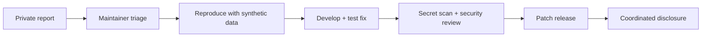

<div align="center">
  <picture>
    <source media="(prefers-color-scheme: dark)" srcset="./assets/brand/codinfy-logo-light.svg">
    <source media="(prefers-color-scheme: light)" srcset="./assets/brand/codinfy-logo-dark.svg">
    
  </picture>

# ⛨ Security Center

**Security and privacy policy for Codinfy Agent Monitor**

[](./docs/security.md)
[](https://github.com/bakalagoin/codinfy-agent-monitor/security/advisories/new)
[](#-security-controls)

[**README**](./README.md) · [**Threat model**](./docs/security.md) · [**Contributing**](./CONTRIBUTING.md) · [**License**](./LICENSE)
</div>

---

> [!IMPORTANT]
> **Do not disclose a vulnerability in a public issue, discussion or pull request.** Use [GitHub private vulnerability reporting](https://github.com/bakalagoin/codinfy-agent-monitor/security/advisories/new).

> [!CAUTION]
> Never include a real API key, access token, password, private key, `.env` file, production credential, private log or user data in a report. Redact sensitive evidence before sending it.

## ◉ Supported versions

| Release line | Status            | Security updates |
| ------------ | ----------------- | :--------------: |
| `0.1.x`      | Current public V1 |        ✓         |
| `< 0.1.0`    | Pre-release       |        —         |

Security fixes target the current release line. Upgrade to the newest patch before reporting behavior already corrected upstream.

## ⚡ Report privately

<div align="center">

[](https://github.com/bakalagoin/codinfy-agent-monitor/security/advisories/new)

</div>

Include only the minimum safe evidence needed to reproduce the issue:

```text
1. Affected version and commit
2. Operating system and Node.js version
3. Affected interface: CLI, TUI, WebSocket, dashboard, MCP, adapter or report
4. Reproduction steps using synthetic/redacted data
5. Expected behavior and observed impact
6. Suggested mitigation, if known
7. Whether active exploitation is suspected
```

<details>
<summary><strong>What belongs in a private report?</strong></summary>

- a secret or credential can escape redaction;
- the local dashboard becomes remotely reachable unexpectedly;
- crafted MCP input can execute an unintended command;
- path handling can read or write outside the monitored project;
- report export leaks private environment or user data;
- SQLite state can be corrupted or accessed across an unexpected boundary;
- a template weakens host security or silently sends sensitive content;
- Safe Guard or review-before-commit can be bypassed in a meaningful way.

</details>

<details>
<summary><strong>What can use a normal public issue?</strong></summary>

- non-sensitive documentation corrections;
- display, animation or accessibility bugs;
- CLI wording and harmless validation problems;
- feature proposals without exploit details;
- compatibility issues that do not expose private data or execute unsafe actions.

</details>

## ⟁ Disclosure workflow



We ask reporters to allow reasonable time for validation and remediation before public disclosure. Response times depend on severity, reproducibility and maintainer availability; they are targets, not contractual guarantees.

| Stage                   | Target                                              |
| ----------------------- | --------------------------------------------------- |
| Initial acknowledgement | As soon as maintainers can safely triage the report |
| Severity assessment     | After reproducibility and impact are established    |
| Fix coordination        | Privately with the reporter when appropriate        |
| Public disclosure       | After a patch or agreed mitigation is available     |

## ⛨ Security controls

| Control                   | Behavior                                                                  |
| ------------------------- | ------------------------------------------------------------------------- |
| **Local-first storage**   | Operational state remains under `.codinfy-agent-monitor/` by default      |
| **Loopback dashboard**    | Fastify binds to `127.0.0.1` unless the operator deliberately changes it  |
| **Output redaction**      | CLI, MCP and report output passes through common secret masking           |
| **Git-aware scanner**     | Scans tracked and unignored files without returning matched secret values |
| **Safe Guard**            | Enabled by default; monitoring does not imply destructive authorization   |
| **Explicit execution**    | Tests and build run only with `--run`                                     |
| **Model confirmation**    | The Smart Model Router never switches models automatically                |
| **Attribution integrity** | Public-ready review checks mandatory identity files                       |
| **Pre-commit review**     | Combines secrets, Git, tests, build and sensitive-file signals            |
| **MCP integration test**  | A real client connects over stdio, lists tools and calls attribution      |

## ◫ Data boundaries

```text
Project files ──read-only observation──► Core monitor
Agent events ──validated + normalized──► Local SQLite
Provider usage ──official or estimated─► Provenance-aware metrics
CLI / MCP / reports ──redaction────────► User-visible output
Dashboard ──127.0.0.1 + WebSocket──────► Local operator
```

Codinfy Agent Monitor is a monitoring product, not a credential vault. Do not intentionally store secrets in timeline events, task titles, agent messages or exported reports.

## ✓ Security validation

Before proposing or releasing a security-sensitive change:

```bash
pnpm check
node packages/cli/dist/index.js tests --run
node packages/cli/dist/index.js build --run
node packages/cli/dist/index.js secrets
node packages/cli/dist/index.js attribution-check
node packages/cli/dist/index.js review
pnpm audit --audit-level high
git diff --check
```

The scanner is defense in depth, not proof that a repository contains no secret. Human review remains required before publication.

## ◇ Safe research rules

- Use only systems, repositories and credentials you own or are authorized to test.
- Prefer synthetic fixtures and temporary local projects.
- Avoid privacy violations, service disruption, persistence and destructive actions.
- Do not access, alter or retain another person's data.
- Stop testing once meaningful impact is demonstrated.
- Coordinate disclosure before publishing exploit details.

## ⚖ Attribution & policy integrity

Security changes must preserve the product identity and may not remove or weaken:

```text
Codinfy Agent Monitor
/codinfy
codinfy-agent-monitor
© CODINFY PLATFORMS SASU
codinfy.com
Created by CODINFY PLATFORMS SASU
Bakala Goin — Founder & CEO
```

See the [Codinfy Agent Monitor Attribution License 1.0](./LICENSE).

---

<div align="center">
  <picture>
    <source media="(prefers-color-scheme: dark)" srcset="./assets/brand/codinfy-logo-light.svg">
    <source media="(prefers-color-scheme: light)" srcset="./assets/brand/codinfy-logo-dark.svg">
    
  </picture>

### Security through visibility

[](https://codinfy.com)
[](https://facebook.com/codinfyci)
[](https://instagram.com/codinfyci)
[](https://linkedin.com/company/codinfyen)
[](https://tiktok.com/@bakalagoin)
[](https://x.com/bakalagoin)

<br><br>

**Created by CODINFY PLATFORMS SASU**<br>
**Bakala Goin — Founder & CEO**<br>
**© CODINFY PLATFORMS SASU · [codinfy.com](https://codinfy.com)**
</div>
